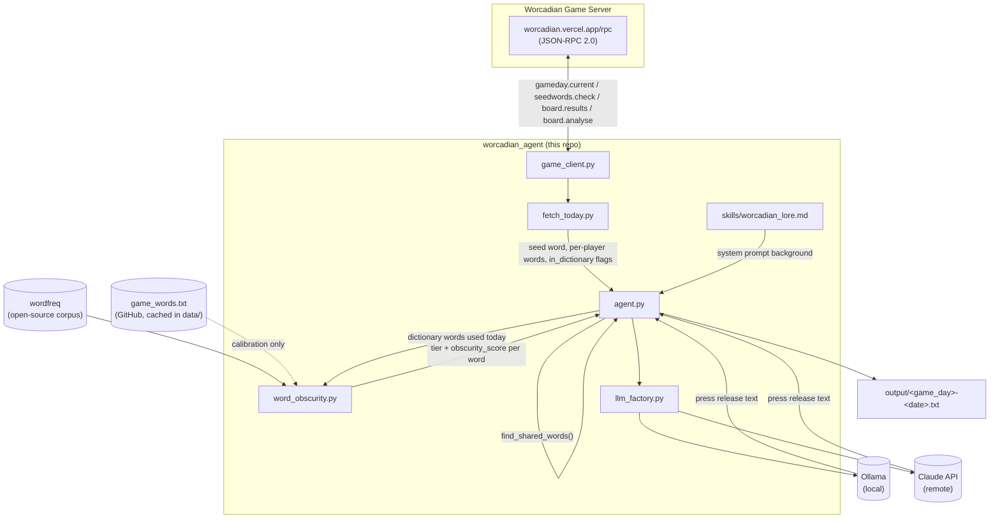

# Design

## Architecture

The pipeline is a deterministic fetch/score/detect sequence in plain Python, followed by a single
LangChain prompt → LLM → parser call for the write-up. There is no tool-calling agent loop — every
fact the LLM sees is computed ahead of time in Python and handed to it as JSON plus a couple of
plain-English notes, which is more reliable than letting the LLM decide when to call tools or derive
facts (like duplicate detection) from raw data itself.

## What each script does

### `worcadian_agent/game_client.py`
Thin JSON-RPC client for `https://worcadian.vercel.app/rpc`. One function, `rpc(method, params)`,
plus one-line wrappers for the four methods the pipeline uses:

- `gameday_current()` — the server's currently valid `{min_day, max_day}` range.
- `seed_word(day)` — the seed word for a game day.
- `board_results(day)` — submission count, best score, and the winning boards (as raw 121-character
  board strings) for a game day.
- `board_analyse(board)` — decodes a board string into `{score, words, in_dictionary}`.

Raises `RuntimeError` on a JSON-RPC error response — this is a genuine external-system boundary, so
it's the one place in the pipeline that deliberately doesn't try to recover from bad input.

### `worcadian_agent/fetch_today.py`
`fetch_today_data(day=None)` ties the above together: resolves "today" to the server's `max_day` if
no day is given, fetches the seed word and best-score submissions for that day, and runs each
submission's board through `board_analyse` to get the actual words each player played (`board.results`
only returns raw board strings, not word lists). Also runnable standalone — `python -m
worcadian_agent.fetch_today` prints the assembled JSON.

### `worcadian_agent/word_obscurity.py`
Scores how obscure a word is, combining two signals:

- **Length** — Worcadian's own rule: a word of 9+ letters is tagged `WOW` outright, since chaining
  that many unique letters off the seed is inherently hard, regardless of how common the word is.
- **Corpus frequency** — [`wordfreq`](https://github.com/rspeer/wordfreq) (MIT-licensed, open source),
  which gives a word's Zipf frequency across real English corpora (Wikipedia, subtitles, news, books,
  Reddit). A word absent from all of them (`zipf == 0`) is tagged `OBSCURE`; below a threshold,
  `UNCOMMON`; otherwise `COMMON`.

`score_word`/`score_words` return `{word, length, zipf, tier, obscurity_score}` (0–100, higher =
more obscure). The `--calibrate` flag downloads and caches the full ~65k-word game vocabulary
(`data/game_words.txt`, from the [crosswords repo](https://github.com/whatgamestudios/crosswords)) and
prints its Zipf distribution — this is how the `UNCOMMON` threshold was chosen (over half the game's
legal words have zero general-corpus frequency, confirming the game's "broad and inclusive" word list
described in its own lore), and is meant to be run during development, not on every invocation.

### `worcadian_agent/llm_factory.py`
`get_llm(provider, model)` returns a LangChain chat model — `ChatOllama` (local, default,
`WORCADIAN_LLM_PROVIDER=ollama`) or `ChatAnthropic` (remote Claude, `WORCADIAN_LLM_PROVIDER=anthropic`,
needs `ANTHROPIC_API_KEY`). Provider/model resolve from function args, then environment variables,
then hardcoded defaults, so the pipeline runs out of the box with no API key.

### `worcadian_agent/skills/worcadian_lore.md`
The game's rules and lore, verbatim, loaded as plain text into the LLM's system prompt in `agent.py` —
this is what gives the LLM background on the game itself, separate from today's specific facts.

### `worcadian_agent/agent.py`
Orchestrates the whole pipeline:

1. `fetch_today_data()` — today's seed word, best score, and per-player words.
2. `score_words()` on the union of all dictionary words actually played (junk letter-strings that
   aren't real words are excluded — they inflate score under the game's rules but aren't "words" to
   rate for obscurity).
3. `find_shared_words()` — a plain word → players-who-used-it count, excluding the seed word itself
   (trivially present in every submission) and words used by only one player. This result is also
   rendered into an explicit plain-English sentence (`shared_note`) and handed to the LLM directly,
   rather than relying on the model to infer convergence from the JSON — this was added after an
   early test showed a small local model hallucinating a shared word that wasn't real (see
   Limitations).
4. Builds a `ChatPromptTemplate` (system = lore + reporter instructions, human = the facts as JSON +
   `shared_note`) and runs it through `prompt | get_llm(...) | StrOutputParser()`.
5. Writes the result to `output/<game_day>-<YYYY-MM-DD>.txt`.

## Limitations

- **Small local models don't reliably follow length/format instructions.** Testing with a local
  7B Ollama model (`mistral:latest`) produced summaries well under the ~500-word target and
  occasionally added a title line despite being told not to. This is a model-capability limit, not a
  pipeline bug — a larger local model or `--provider anthropic` tracks the target far more closely.
- **Obscure-word definitions can be hallucinated.** The prompt asks the LLM to define one obscure
  word and to say so if it isn't confident of the meaning, but a weak model may still confabulate a
  plausible-sounding but wrong definition instead of admitting uncertainty. There's no independent
  dictionary-definition source wired in to verify this.
- **`wordfreq` is a general-English corpus, not game-specific.** It's a good proxy for obscurity but
  wasn't built for word-game vocabularies — some legitimate but very domain-specific dictionary words
  may score as `OBSCURE` for reasons unrelated to how "surprising" they'd feel to a player.
- **Shared-word detection is exact-string, not stem-aware.** `GROWTH` and `GROWTHS` are correctly
  treated as different words (matching the game's own scoring, where each is counted separately), but
  this also means near-miss variants are never flagged as "the same discovery" even when a human
  reader might consider them related.
- **Only the best-score submissions are considered.** `board.results` returns only the submissions
  tied for the best score for a day, so the press release reports on the winning solutions only, not
  the full spread of everyone who played.
- **Live network dependency, no offline/cached mode.** Every run hits the live game server and (for
  `--calibrate`) GitHub directly; there's no retry/backoff logic beyond what `requests`/`urllib`
  provide by default, and a server or network outage will simply raise an exception.
- **Day selection can be ambiguous near the UTC day boundary.** `gameday.current`'s `max_day` is the
  most recently opened day across all timezones, which may still have submissions trickling in when
  the script runs, rather than a fully "settled" day.
